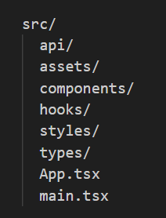

# Workshop: Modern Frontend Development from Scratch - with React and TanStack Query
*Total time estimate: 3.5 hours* ⏳

Facilitated by: Daniel Aasheim

*Have you ever wondered how to create a React project from scratch or just want more practice? Then this workshop is perfect for you! We will set up a frontend project using React, Vite, TypeScript, and TanStack Query. The latter will be used to connect to an API for CRUD operations. No prior knowledge is required.*

## Introduction to today's workshop: ©️The Boucket List
*Time estimate: 5 minutes* ⏳

In preparation for this workshop I have built a backend application called **The Boucket List**, which is currently running in Azure, where it has been deployed.

**The Boucket List** is a web API built with ASP.NET Core for managing **Boucket Lists** and **Boucket Items**. It provides endpoints for creating, reading, updating, and deleting (CRUD) both **Boucket Lists** and **Boucket Items**. The application uses Entity Framework Core for data access and connects to a SQL Server database using Azure Active Directory for passwordless authentication. 🔓

Before we dig in, you can have a sneak-peek at the API, its endpoints and their operations here: [the-boucket-list.azurewebsites.net](https://the-boucket-list.azurewebsites.net/). 👀

#### By the way, the frontend technologies we will use today include:
- Node.js
- Vite
- React
- TypeScript
- Axios
- TanStack Query

Please note that today's workshop will focus exclusively on frontend development, and we will not be covering any backend-related topics.

### Okaaaaaay, let's go... 🎤
So, today's workshop agenda is the following:
- **Part A**: In the next 20 minutes or so, we should try to completely set up a template project in React using Vite as the build tool.
- **Part B**: The rest of the day, we build upon our template app, and try to connect it with **The Boucket List** API.

## Part A: Let's build a React app template from scratch! 🔧🔨🏠
*Time estimate: 20 minutes* ⏳
### Step 0: Install Node.js and npm - hopefully you did this yesterday 😇

Before you can use Vite, you need to install Node.js, which comes with npm (Node Package Manager). Visit the [Node.js website](https://nodejs.org/) to download and install the version of Node.js suitable for your operating system. You should preferrably install the latest version, **v20.17.0**, which is the one I use.

To verify the installation, open a terminal or command prompt and run:

```bash
node -v
npm -v
```

### Step 1: Create a new Vite project ✨

Assuming you already have Node.js installed, on we go!

#### Initialize the project
Note the extra double-dash, which is needed for npm 7+
```bash
npm init vite@latest my-vite-project -- --template react-ts
```

This command will create a folder named `my-vite-project` and set up a React project within it, with TypeScript, using the Vite build tool.

### Step 2: Install default dependencies ⚙️

Navigate to your newly created project directory and install the dependencies:

```bash
cd my-vite-project
npm install
```

### Step 3: Run the development server ▶️

To start the development server, run:

```bash
npm run dev
```

This command will start the Vite development server, and you should see the output in your terminal that includes the local URL, typically `http://localhost:{a-four-digit-number}`, where you can view your new React app.

After you have confirmed that it is up and running, proceed with step 4.

### Step 4: Install additional dependencies ⚙️
No need to read through all this stuff, you could just copy and paste the bash commands into your terminal.


#### Axios
- HTTP requests: A JavaScript library for making HTTP requests from the browser.
- Backend connection: Acts as the connection between the backend API and the frontend application.
```bash
npm install axios
```

#### TanStack Query for React
- Simplifies data fetching: Makes data fetching, caching, synchronization, and updating server state easier
- Async operations: Simplifies handling asynchronous operations and server state management.
- Automatic caching: Automatically caches data to improve performance.
- Background updates: Keeps the UI fresh and up-to-date with background updates. 
```bash
npm install @tanstack/react-query
npm install @tanstack/react-query-devtools
```

#### Styled Components
- Popular library: A widely-used library for styling React applications.
- CSS styling: Allows you to write actual CSS code to style your components.
- Scoped styles: Ensures styles are scoped to the component, preventing style leakage.
- Dynamic styling: Supports dynamic styling based on props.
```bash
npm install styled-components
npm install @types/styled-components
```

### Step 5: Build your own app on top of the Vite template 🔧🔨

After the app is up and you have installed your desired dependencies, there are different ways to proceed. 

#### Folder structure 📁
One way to start building upon the template is to think about the structure of the project, and begin setting up your folders. Some things are probably still not that clear, however a common folder structure looks something like this.



For instance, this is how we could populate these folders (suffix in parenthesis is the typical file extension used in the respective folders):

- **src**: typically holds root components of the applications (App.tsx, main.tsx) and other configuration files for Git, TypeScript, ESLint and so on (.json, .js, .ts, .html)
- **api**: holds the Axios stuff, such as API request functions (.ts)
- **assets**: for static assets like images, fonts, and icons (.png, .jpg, .svg, etc.)
- **components**: where we put our React components (.tsx)
- **hooks**: contains the hooks related to TanStack Query (.ts)
- **styles**: where we put our Styled Components (.ts)
- **types**: holds files with the definitions of our custom TypeScript interfaces and types (.ts)

Other types of folders - not necessarily used today - include:

- **context**: for React context providers and related files (.ts, .tsx)
- **utils**: for utility functions and helper methods (.ts)
- **services**: for business logic and service classes (.ts)
- **tests**: for unit and integration tests (.test.ts, .test.tsx)


**Obviously, the app building itself is the most time consuming step of the process, and unfortunately, the 3.5 hours given for today's workshop is not sufficient to complete this step today (without our artificially intelligent friends, at least).**

**Therefore, I have *juksa litt* and created most of the files (if not all) for you. I have tried to remove crucial components, files, and functions, for you to implement yourself. I will explain in more detail below.**


## Part B: Scratch the application we just built! 🏡🔥😬
*Time estimate: 3 hours* ⏳

### Step 1: Clone the workshop repo to get started 🐑

**It is now time to say goodbye to our beloved React template project, and get our workshop repo: [the-boucket-list-fe-workshop](https://github.com/daniel-aasheim/the-boucket-list-fe-workshop). Well, as you probably figured, you are infact already here! Just clone the repo and code away!**

### Step 2: Solve TODO's one by one! ✔️

**A guide to get started: Navigate to the root of the project, and in the search pane/window type in `TODO`, and you'll get the deal! Throughout the project I have removed more and less crucial code, and swapped them with TODO's, for you to solve. It's important that you solve the TODO's in order, or else you'll run into heaps of hurdles. I hope you have fun!**

Below are the TODO's listed:

| Task ✔️  | Task description                                                             | Where to look 👀        | Time estimate ⏳ |
|----------|------------------------------------------------------------------------------|--------------------------|------------------|
| TODO 1   | Define the parameters for the API functions                                  | listsEndpoint.ts         | <20 minutes      |
| TODO 2   | Implement the API functions (using Axios)                                    | listsEndpoint.ts         | <30 minutes      |
| TODO 3   | Implement the handler functions in AllBoucketLists.tsx                       | AllBoucketLists.tsx      | <40 minutes      |
| TODO 4   | Set up TanStack Query                                                        | main.tsx                 | <5 minutes       |
| TODO 5   | Implement TanStack Query hooks                                               | useBoucketLists.ts       | <30 minutes      |
| TODO 6   | Replace useEffect() pattern with TanStack Query hooks in AllBoucketLists.tsx | AllBoucketLists.tsx      | <10 minutes      |
| TODO 7   | Enable CurrentBoucketList card to be rendered and explore UI                 | App.tsx                  | <5 minutes       |
| TODO 8   | Enable UnassignedBoucketItems card to be rendered and explore UI             | App.tsx                  | <5 minutes       |
| TODO 9   | Investigate how the app behaves when query keys changes                      | UI                       | whatever's left  |

❗❗❗ **Remember, let's take breaks every now and then! We'll aim for at least one each hour.** ❗❗❗

**By the way, if we see that things take more time than estimated, you could be a bit pragmatical and copy code from similar components elsewhere in the code. An alternative is to check the repository of the fully functional app, which you find here: [the-boucket-list-fe](https://github.com/daniel-aasheim/the-boucket-list-fe)** 👀

On the other hand, if you are able to solve all the tasks, you are very welcome to refactor the project into into even smaller, reusable chunks. Think KISS, DRY, single responisbility, etc. I know that at least the main three components have some duplicated code that I did not have time to refactor myself. You might find other areas of the code, as well, that can be improved through refactoring. 💡

***Thank you for joining my workshop today - I bet I had fun! Hope you had too!*** ❤️


### Step 1337: Build and serve for production (not on today's agenda)! 🚀


## Additional notes 📚

To help you get the most out of the technologies used in this workshop, here are some useful documentation links:

- [Vite Documentation](https://vitejs.dev/guide/): For further customization and optimization of your build process.
- [React Documentation](https://react.dev/): To learn more about creating components, managing state, and building an interactive UI.
- [TypeScript Documentation](https://www.typescriptlang.org/docs/): To utilize its features to the fullest and maintain type safety in your application.
- [Axios Documentation](https://axios-http.com/docs/intro): For making HTTP requests.
- [TanStack Query Documentation](https://tanstack.com/query/latest/docs/framework/react/overview): For managing server state.
- [Styled Components Documentation](https://styled-components.com/docs): For styling your React components.


